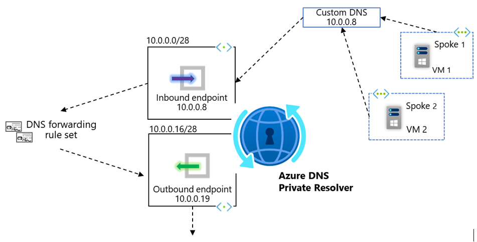
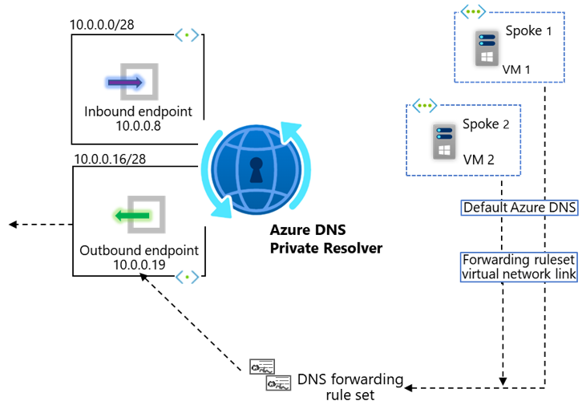
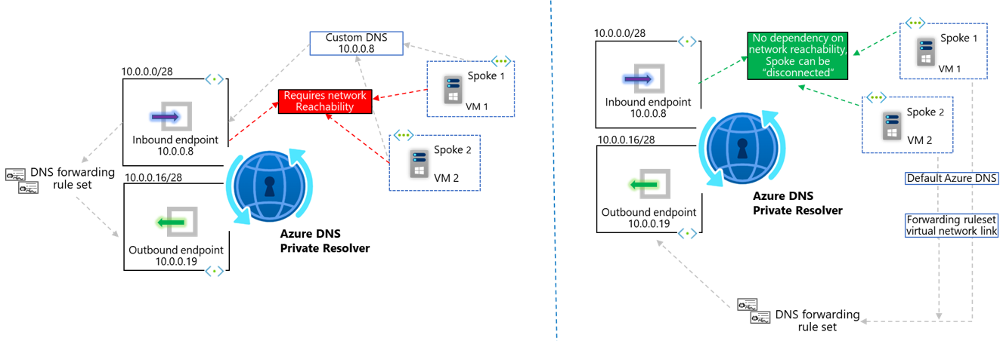
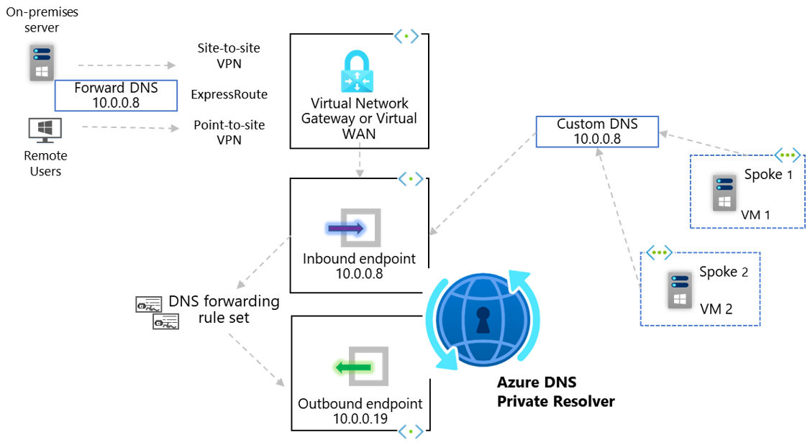
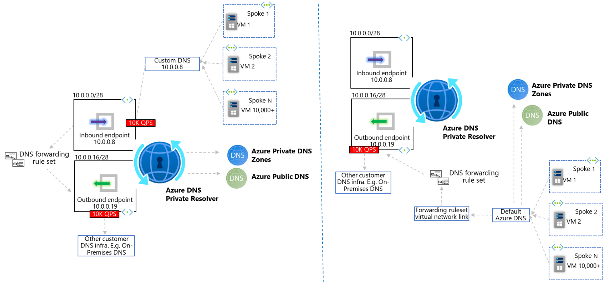
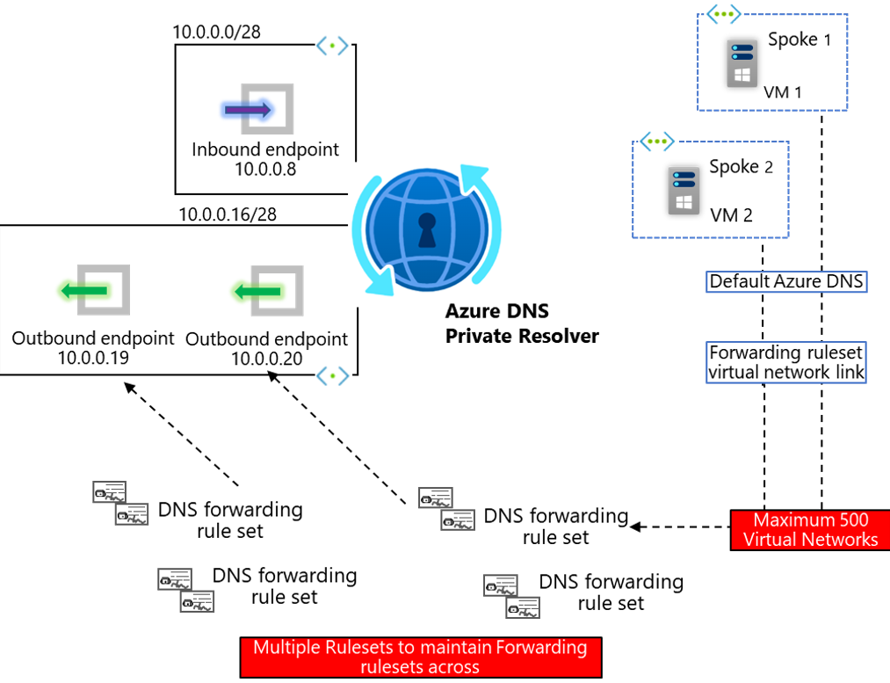
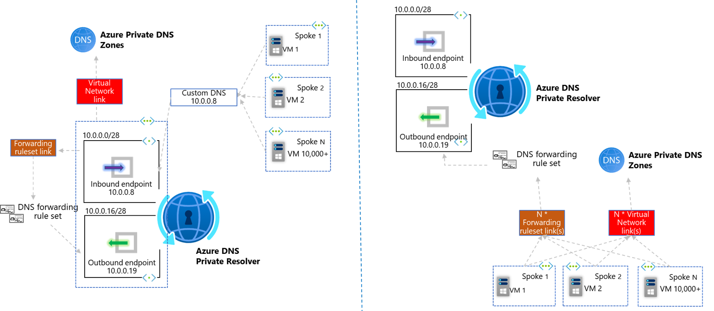
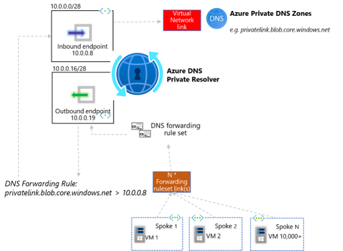
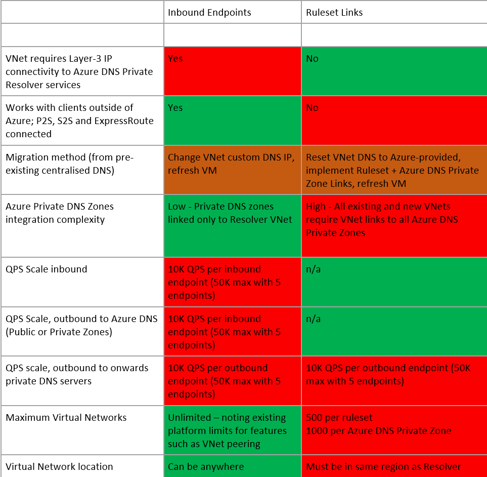

# Azure DNS Private Resolver topology options

# Introduction 

The Azure DNS Private Resolver service is injected into your Virtual Network and utilises network interfaces for two functions:

1)	**Inbound Endpoints** – a maximum of five – used to receive inbound resolution requests from clients within your internal private network (Azure or On-Premises). 
2)	**Outbound Endpoints** – a maximum of five – used to forward resolution requests to destinations within your internal private network (Azure or On-Premises), that cannot be resolved by Azure DNS Private Zones. How the outbound endpoint behaves in respect to forwarding, is dictated by the configuration of the associated DNS Forwarding Ruleset

See “[What is Azure DNS Private Resolver?](https://learn.microsoft.com/en-us/azure/dns/dns-private-resolver-overview)” for full technical details and product overview.

# Resolution options

For the Azure DNS Private Resolver to process DNS requests, there are two architectural options for forwarding queries to the service:

1)	Send DNS requests directly to one of the **Inbound Endpoint** IP addresses associated with your Resolver service

2)	If your request is being initiated by a service within an Azure Virtual Network, such as a Virtual Machine, we have the option of linking the Virtual Network itself to the DNS Forwarding Ruleset via a **Ruleset Link**

Both patterns will result in successful resolution for your client. The point of this document is to discuss the pros and cons of each option, for you to make the right choice based on your requirements today, and in the future. 

# Architectural considerations

## IP Network Connectivity

Option 1, Inbound Endpoints, requires Layer-3 network connectivity _(E.g. VNet peering, hub/spoke, Virtual WAN, ExpressRoute/VPN)_ between the client originating the DNS requests, and the Virtual Network within which the Inbound Endpoint resides. Therefore, if you have a scenario where you wish to leverage centralised forwarding logic for disconnected Virtual Networks, then Option 2, Ruleset Links, is your required pattern.

Option 1, Inbound Endpoints, allows queries to originate from any IP address that has Layer-3 network connectivity to the Inbound Endpoint, this includes On-Premises networks. Location outside of Azure cannot leverage option 2, Ruleset Links, as fundamentally they are not Azure hosted Virtual Networks. 

## Query performance and scale

Each inbound and outbound endpoint, today, can support up to 10,000 DNS queries per second (QPS). For most use cases, these limits are beyond typical query performance requirements, even for very large Enterprise customers on Azure. 

However, there are some scenarios, wherein the QPS performance, is something which we want to consider more deeply. An example of which is large Virtual Desktop (VDI) deployments on Azure, which put atypical load on DNS infrastructure due to a) _Users_ typically utilizing DNS more than Infrastructure _Servers_ and b) the often very large number of Virtual Machines used in these solutions. In these scenarios, option 2, Ruleset Links, has some performance benefits. 

In the diagram below, note how option 2 removes the Inbound Endpoint QPS constraint, and whilst we still must consider the outbound QPS limit (if forwarding to other DNS servers within your infrastructure), this pattern effectively removes any QPS limit when resolution occurs via Azure Public DNS, or an Azure Private DNS Zone (wherein resolution occurs directly with the Azure DNS Service and does not utilise the Resolver product). 

## Implementation and migration

Prior to Azure DNS Private Resolver customers had to build and maintain their own DNS infrastructure for centralised forwarding. A common pattern was to utilise Windows integrated DNS on pre-existing IaaS Domain Controller Virtual Machines. To leverage this pattern customers will already be familiar with [setting custom DNS](https://learn.microsoft.com/en-us/azure/virtual-network/virtual-networks-name-resolution-for-vms-and-role-instances#specify-dns-servers) servers at the Virtual Network level.

Option 1, Inbound Endpoints, has a requirement to set these DNS servers in the same way at the VNet level. Some customers will be more comfortable changing the IP address within VNet-level custom DNS to migrate and leverage the Azure DNS Private Resolver service. Note that this will require a [reboot/refresh](https://learn.microsoft.com/en-us/azure/virtual-network/virtual-networks-name-resolution-for-vms-and-role-instances#specify-dns-servers:~:text=New%2DAzureVM.-,Note,-If%20you%20change) for the updated DNS setting to take effect. 

Option 2, Ruleset Links, requires leveraging a newer paradigm, wherein each Virtual Network uses the default Azure-provided DNS (via the special IP address [168.63.129.16](https://learn.microsoft.com/en-us/azure/virtual-network/what-is-ip-address-168-63-129-16)) and is also [linked](https://learn.microsoft.com/en-us/azure/dns/dns-private-resolver-get-started-portal#link-your-forwarding-ruleset-to-the-second-virtual-network) to each DNS Forwarding Ruleset. A maximum of 500 Virtual Networks can be linked to a Ruleset. There can be more than one Ruleset per Resolver (A maximum of 10, today, calculated by multiplying maximum DNS forwarding rulesets per outbound endpoint [2] by maximum Outbound endpoints per DNS private resolver [5]), therefore this model can be more complicated to maintain due to the many-to-many relationship required to instantiate and maintain in your Infrastructure-as-code. 

## Operational complexity and Azure Private DNS Zones integration

If part of your DNS resolution topology also requires the use of Azure DNS Private Zones, we should consider the implications for integration of these resources with the two different Azure DNS Private Resolver topologies.

Option 1, Inbound Endpoints, fundamentally results in queries to Azure DNS being sourced by the Inbound Endpoint itself. Whilst this has the scale considerations laid out in section [b], it does also come with simplification of the Virtual Network Links used as part of Azure DNS Private Zones. Specifically, when using Inbound Endpoints, as the queries always originate from a single Virtual Network (the one within which your Inbound Endpoints as located), only this VNet itself needs linking to your Azure DNS Private Zone.

To leverage the distributed nature of pattern 2, Ruleset Links, we have already understood how each Virtual Network must be linked to each Forwarding Ruleset. This same logic applies when it comes to Azure DNS Private Zones. I.e. If your VNet level DNS settings remain as default Azure-provided DNS, you must link that VNet directly to your Azure DNS Private Zone directly, in order to leverage resolution of record-sets inside these resources. In fact, when implementing this pattern, the Resolver service is not used at all in resolution of forward-lookup zones hosted in either Azure Public DNS, or Azure DNS Private Zones. A maximum of 1000 Virtual Networks can be linked to a single Azure DNS Private Zone.

E.g. When using option 2, Ruleset Links, if you instantiate a new Virtual Network, this must be linked to all existing DNS Forwarding Ruleset’s and Azure DNS Private Zones.

Note. It is possible to simplify the integration of Azure DNS Private Zones for option 2, Ruleset Links, by implementing Ruleset logic that re-points queries leaving an Outbound Endpoint, back at the Inbound Endpoint  . Whilst this can simplify and reduce the requirement for Azure DNS Private Zone Virtual Network Links, it does re-introduce the constraints of QPS scaling as laid out in section [b]. This approach fundamentally works due to the processing order which Azure DNS Private Resolver follows, detailed [here](https://learn.microsoft.com/en-us/azure/dns/dns-private-resolver-overview#how-does-it-work), wherein Azure DNS Private Zone records take precedence over any logic defined in the DNS Forwarding Rulesets. Therefore, for this approach, it is important to ensure that the Azure DNS Private Zone is linked only to the VNet within which the Private Resolver Inbound Endpoint resides, typically a Hub or centralised Virtual Network. 

# Conclusion

We have shown that the Azure DNS Private Resolver service has two fundamental topology options for integration into your wider private DNS resolution design. 

1.	Option 1 - Send DNS requests directly to one of the **Inbound Endpoint** IP addresses associated with your Resolver service
2.	Option 2 - If your request is being initiated by a service within an Azure Virtual Network, such as a Virtual Machine, we have the option of linking the Virtual Network itself to the DNS Forwarding Ruleset via a **Ruleset Link**

The following table summarises the considerations discussed in this document.

